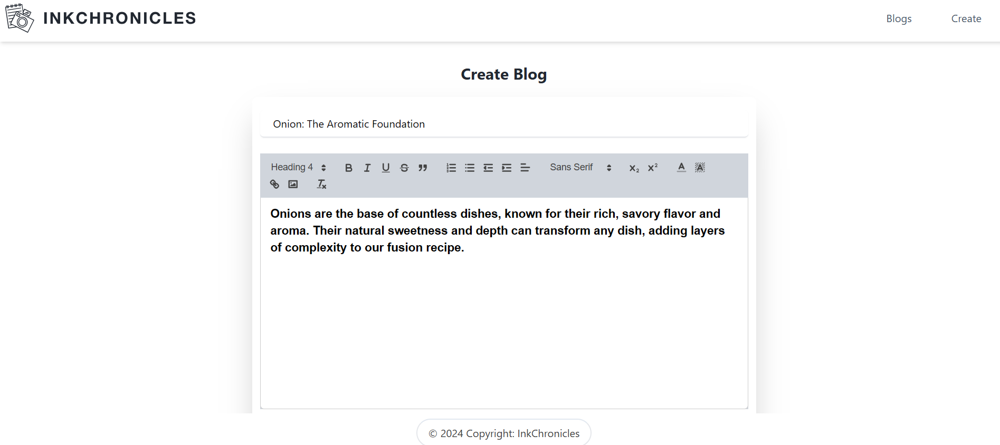
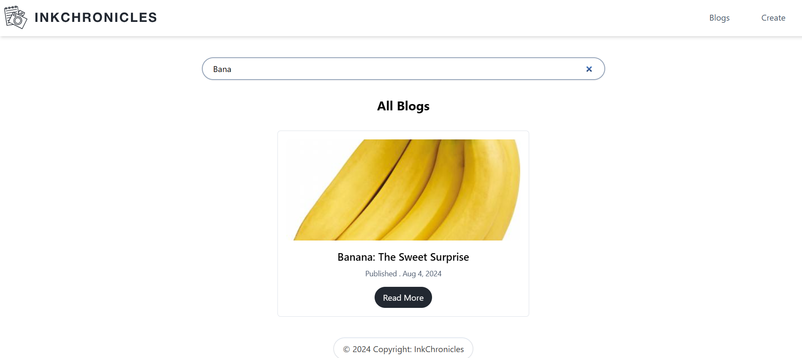
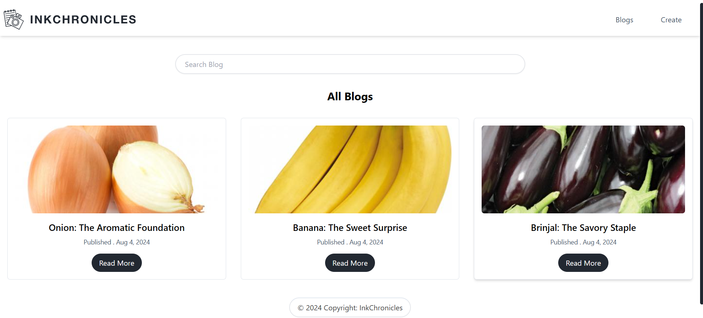
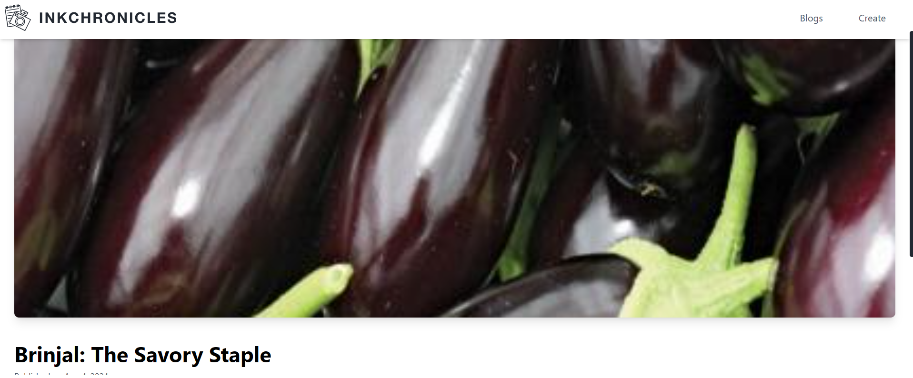

# React Blog Creator

## Overview

React Blog Creator is a user-friendly blogging application that allows users to create, edit, and manage blog posts with ease. The app features a rich text editor powered by React Quill, image upload functionality, and comprehensive blog management tools including search and detailed views.

## Features

- **Create Blogs**: Use the rich text editor to create content and upload images to enhance your blogs.
- **Search Blogs**: Easily find blogs by searching through titles.
- **View Blogs**: Browse through the list of published blogs.
- **Detailed Blog Views**: Click on individual blogs to read the full content.

## Screenshots

### Create Blog



### Search Blogs



### View Blogs



### Detailed Blog View



## Getting Started

### Prerequisites

- Node.js
- npm

### Installation

1. Clone the repository:
   ```bash
   git clone https://github.com/Abdur-Rehman-643/React-Blog-Creator.git
   ```
2. Navigate to the project directory:
   ```bash
   cd React-Blog-Creator
   ```
3. Install the dependencies:
   ```bash
   npm install
   ```
4. Start the development server:
   ```bash
   npm run dev
   ```

## Technologies Used

- **React**: A JavaScript library for building user interfaces.
- **React Quill**: A rich text editor for React.
- **Vite**: A build tool that provides a faster and leaner development experience for modern web projects.

## Contributing

Contributions are welcome! Please feel free to submit a Pull Request.
